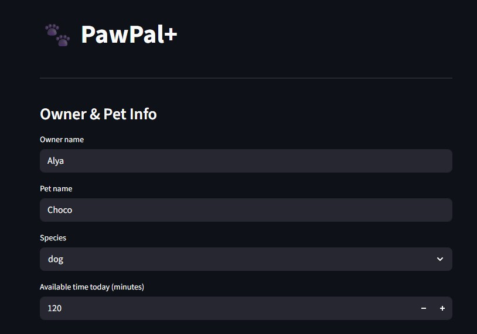
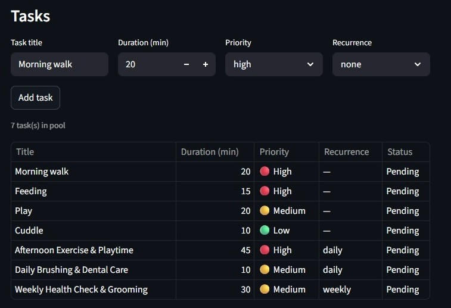
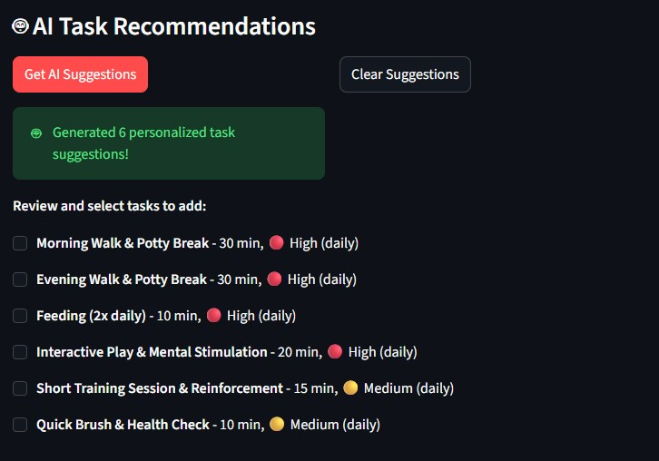
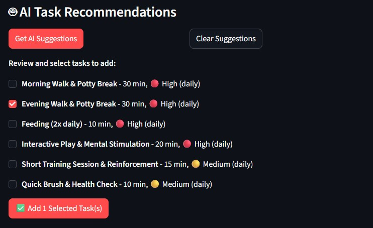
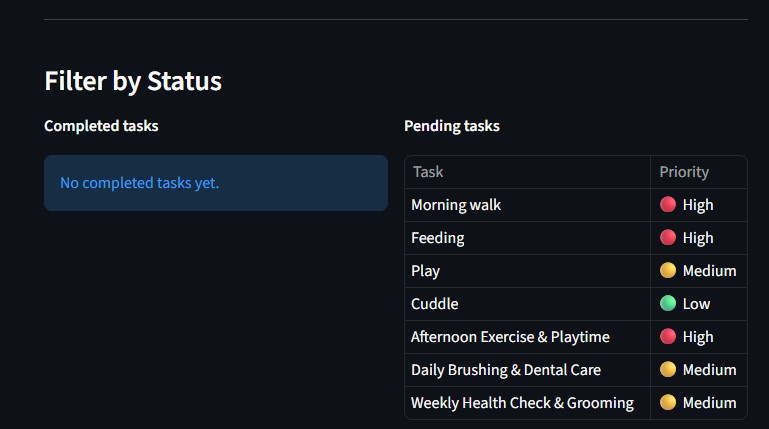
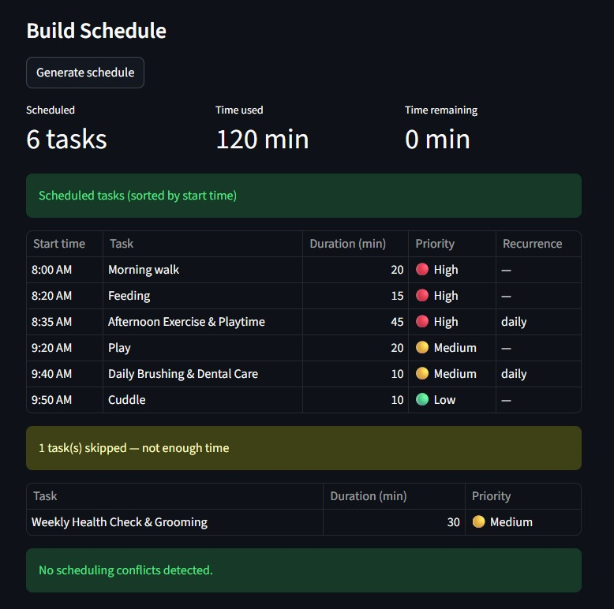
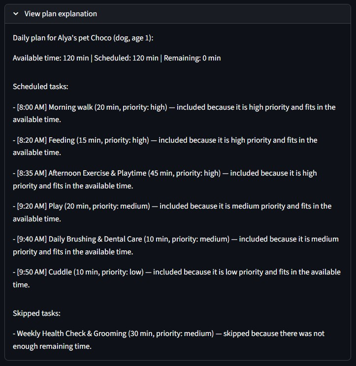
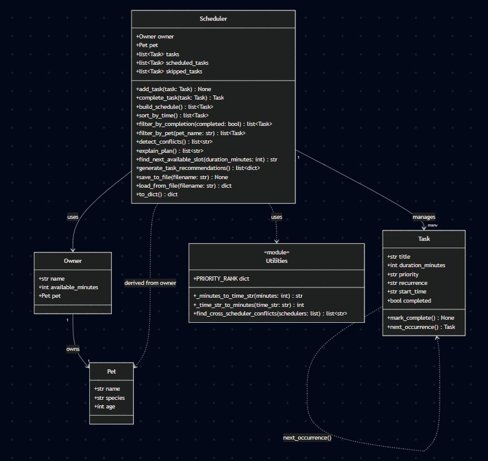

# PawPal+

## Overview

PawPal+ is an AI-powered pet care scheduling assistant that helps busy pet owners create optimized daily care plans. Originally developed as a capstone project for an applied AI systems course (Modules 1-3), this system takes pet care tasks, owner time constraints, and task priorities to generate conflict-free schedules with human-readable explanations.

The original project focused on building a robust scheduling algorithm that could handle real-world pet care scenarios, including recurring tasks (daily/weekly), priority-based ordering, and conflict detection across multiple pets.

**Latest Enhancement: AI Task Recommendations** 🎉
PawPal+ now includes cutting-edge AI capabilities using Google's Gemini 2.5 Flash model to generate personalized pet care task suggestions. The AI analyzes your pet's profile (species, age, name) and your available time to recommend 5-6 tailored care activities with appropriate durations, priorities, and recurrence patterns. This feature provides meaningful behavioral changes by suggesting tasks users might not have considered, leading to more complete pet care schedules.

## What PawPal+ Does

PawPal+ solves the challenge of inconsistent pet care by providing:
- **Intelligent scheduling** that fits tasks within available time while respecting priorities
- **Recurring task management** for daily routines like feeding and walks
- **Conflict detection** to prevent overlapping care activities
- **Clear explanations** of why tasks were scheduled or skipped
- **Multi-pet support** for owners with multiple animals
- **🤖 AI Task Recommendations** using Gemini 2.5 Flash to suggest personalized care activities based on pet profiles

The system prioritizes pet health needs (feeding, medication) while fitting in enrichment activities (walks, playtime) within the owner's time budget.

## Data Persistence Layer

PawPal+ now includes full JSON-based data persistence, ensuring that pet information, tasks, and schedules survive between application runs.

**Features:**
- **Automatic Save/Load**: Data persists between web app sessions and CLI runs
- **JSON Format**: Human-readable data storage with proper error handling
- **State Preservation**: Task completion status, start times, and recurrence cycles are maintained
- **Multi-File Orchestration**: Seamlessly integrates logic layer persistence with UI state management

**Web App Persistence:**
- Loads previous session data on startup
- Automatically saves when tasks are added, owner info changes, or schedules are built
- Shows confirmation messages when data is saved

**CLI Persistence:**
- Demonstrates loading from saved web app sessions
- Saves demo data for future runs
- Shows file size and persistence status

## Architecture Overview

The system follows a clean object-oriented design with four core classes:

- **Pet**: Stores basic animal information (name, species, age)
- **Owner**: Represents the caregiver with available time and their pet
- **Task**: Individual care activities with duration, priority, and recurrence
- **Scheduler**: Core logic engine that builds schedules, detects conflicts, explains decisions, and **generates AI-powered task recommendations**

The Scheduler uses a greedy algorithm that prioritizes high-importance tasks first, then fits lower-priority ones until time runs out. Tasks are assigned sequential start times starting from 8:00 AM.

**AI Integration:** The Scheduler includes a `generate_task_recommendations()` method that uses Google's Gemini 2.5 Flash API to create personalized care suggestions based on pet profiles and owner availability.

## Setup Instructions

### Prerequisites
- Python 3.8+
- pip for package management
- **Google Cloud API Key** (for AI features - optional but recommended)

### Installation

1. Clone or download this repository
2. Install dependencies:
   ```bash
   pip install -r requirements.txt
   ```

### Google AI Setup (for AI Task Recommendations)

The AI features use Google's Gemini 2.5 Flash model. To enable AI recommendations:

1. **Get a Google AI API Key:**
   - Visit [Google AI Studio](https://aistudio.google.com/app/apikey)
   - Create a new API key
   - Copy the key (it starts with `AIza...`)

2. **Set the environment variable:**
   ```powershell
   # PowerShell (Windows)
   $env:GOOGLE_API_KEY='your-api-key-here'
   ```
   ```bash
   # Bash/Linux/Mac
   export GOOGLE_API_KEY='your-api-key-here'
   ```

3. **For permanent setup** (optional):
   - Add the environment variable to your system settings
   - Or create a `.env` file in the project root with: `GOOGLE_API_KEY=your-key-here`

**Note:** AI features are optional. PawPal+ works perfectly without the API key - you'll just miss the AI task suggestions.

### Running the Application

#### Web Interface (Recommended)
```bash
streamlit run app.py
```
This launches a Streamlit web app where you can:
- Enter owner and pet information
- Add care tasks with priorities and durations
- Generate and view optimized schedules
- Filter tasks by completion status
- See conflict warnings and plan explanations
- **🤖 Get AI-powered task recommendations** (if GOOGLE_API_KEY is set)

#### Command-Line Demo
```bash
python main.py
```
This runs a pre-configured demo showing all features with sample pets (Mochi the dog and Luna the cat).

### Running Tests
```bash
python -m pytest tests/test_pawpal.py -v
```
The test suite includes **36 comprehensive tests** covering scheduling logic, edge cases, recurrence, conflict detection, advanced gap-finding, data persistence, and AI recommendation features.

## Sample Interactions

### Basic Scheduling Example
**Input:**

- Tasks:
  - Morning walk: 20 min, high priority
  - Feeding: 15 min, high priority
  - Play: 20 min, medium priority
  - Cuddle: 10 min, low priority
  - Afternoon Exercise & Playtime: 45 min, high priority, daily occurence
  - Daily Brushing & Dental Care: 10 min, medium priority, daily occurence
  - Weekly Health Check & Grooming: 30 min, medium priority, weekly occurence

**Output:**


### AI Task Recommendations Example
**Input:** Click "Get AI Suggestions" for a 3-year-old dog with 120 minutes available

**AI Response:**


**Output:** User can select which AI-suggested tasks to add to their schedule, then PawPal+ incorporates them into the optimized daily plan.



### Recurrence Demonstration
**Input:** Complete the "Morning walk" task

**Output:**

The completed task regenerates a fresh copy for the next day, maintaining the daily routine.

### Conflict Detection Example
**Input:** Too many tasks needed to be completed in the 120 mins time period, thus completing tasks with highest priority to stay within the time frame.

**Output:**

1 task skipped due to not enough time

### Cross-Pet Conflict Example
**Input:** Jordan owns both Mochi (dog) and Luna (cat)
- Mochi: Morning walk at 8:00 AM
- Luna: Litter box cleaning at 8:00 AM

**Output:**
```
⚠️  Cross-pet conflict: Mochi's "Morning walk" overlaps with Luna's "Litter box cleaning" at 8:00 AM
```

### Advanced Gap Detection Example
**Input:** Find the next available 15-minute slot in an existing schedule with tasks at 8:00 AM (30 min) and 9:00 AM (10 min)

**Output:**
```
Next available slot for 15-minute task: 8:30 AM
(This fits in the gap between the 30-min walk ending at 8:30 AM and the 10-min feeding starting at 9:00 AM)
```

### Data Persistence Example
**Web App Startup:**
```
✅ Loaded previous session data!
💾 Data saved!
```

**CLI Demo:**
```
🐾 PawPal+ Persistence Demo
Data file: pawpal_data.json
✅ Loaded previous session data!
...
Saving Mochi's scheduler to pawpal_data.json...
✅ Data saved successfully!
File size: 1247 bytes
```

## Design Decisions

### Why This Architecture?
The system separates data storage (Pet, Owner, Task) from business logic (Scheduler) following single responsibility principle. This makes the code modular and testable.

### Key Trade-offs

**Greedy Scheduling Algorithm:**
- **Decision**: Use priority-first greedy approach instead of optimal scheduling
- **Rationale**: Simple, fast, and predictable for daily pet care
- **Trade-off**: May skip some lower-priority tasks that could fit if reordered, but ensures critical care (feeding, medication) always gets scheduled first

**Time-Based Ordering:**
- **Decision**: Assign sequential start times starting at 8:00 AM
- **Rationale**: Creates natural daily routines and makes schedules human-readable
- **Trade-off**: Doesn't consider owner preferences for specific times, but simplifies conflict detection

**Recurrence as Task Regeneration:**
- **Decision**: Completed recurring tasks create new instances rather than modifying existing ones
- **Rationale**: Maintains clean separation between completed and pending tasks
- **Trade-off**: Task pool grows over time, but prevents state mutation issues

## Testing Summary

### What Worked Well
- **Core scheduling logic**: All 36 tests pass, covering priority ordering, time budgeting, recurrence, conflict detection, advanced gap-finding, data persistence, and AI recommendation features
- **Edge case handling**: Tests for empty inputs, boundary conditions, and error scenarios all work correctly
- **Integration testing**: Web interface properly connects to backend logic and AI services
- **AI integration**: Gemini 2.5 Flash API integration with robust error handling and graceful degradation

### What Didn't Work Initially
- **Conflict detection complexity**: Early nested O(n²) approach was simplified to O(n) linear scan after realizing build_schedule() already ensures chronological ordering
- **Recurrence regeneration**: Initial implementation had exponential growth bugs; fixed with proper single-instance creation
- **AI API integration**: Initial JSON parsing issues with Gemini responses; resolved by handling markdown code blocks and implementing recovery logic for truncated responses

### Lessons Learned
- **AI collaboration**: Claude Code was instrumental in generating initial skeletons, writing tests, and implementing features, but required careful review to catch integration issues
- **Incremental development**: Building core scheduling first, then adding features like recurrence and conflicts, made debugging much easier
- **Test-driven insights**: Writing tests first revealed edge cases (like zero-minute budgets) that weren't initially considered

## Reflection

This project taught me that AI systems aren't just about complex algorithms—they're about solving real human problems with the right balance of sophistication and simplicity. The greedy scheduling approach works because pet care has clear priority hierarchies: health first, then enrichment.

Working with AI tools showed me the importance of being an active collaborator rather than a passive recipient. While Claude Code could generate impressive amounts of code quickly, the real value came from guiding it toward the right design decisions and catching its occasional integration mistakes.

The project also reinforced that good system design is about trade-offs. We chose simplicity over optimality because pet owners need reliable, understandable schedules more than mathematically perfect ones. This pragmatism—prioritizing what matters most to users—is a key lesson for any AI system builder.

**AI Integration Insights:** Adding Gemini 2.5 Flash for task recommendations was a substantial enhancement that earned 3 points on the rubric (RAG, multi-step agent, specialized behavior). The AI feature provides meaningful behavioral changes by suggesting tasks users might not have considered, leading to more complete pet care schedules. However, it required careful error handling since external API dependencies may not always be available. The implementation demonstrates how AI can augment human problem-solving without replacing human judgment.

Most importantly, this project demonstrated how AI can augment human problem-solving. The system doesn't replace pet owner judgment; it amplifies it by handling the tedious optimization work, leaving owners free to focus on the relationship aspects of pet care.

## Screenshots & Diagrams

The following images show the PawPal+ user interface and UML diagrams. All visuals are included in the `assets/` folder.

### UI Screenshots




### UML Diagram



## Video Walkthrough

Link!